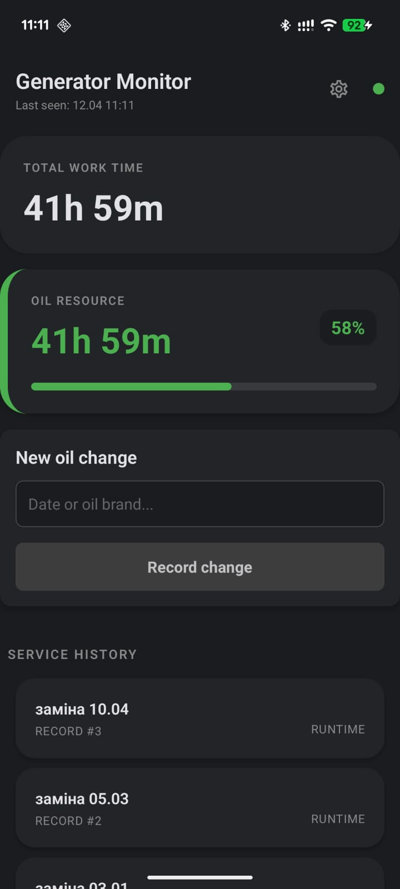
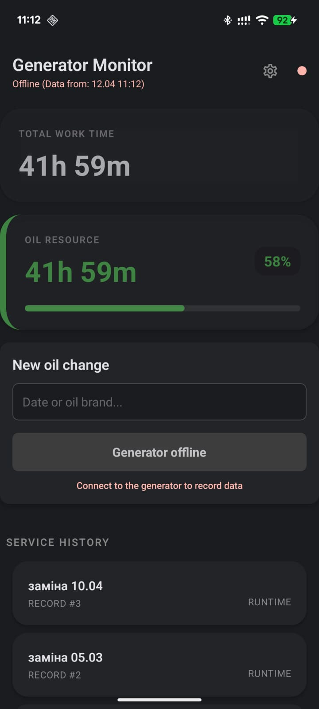
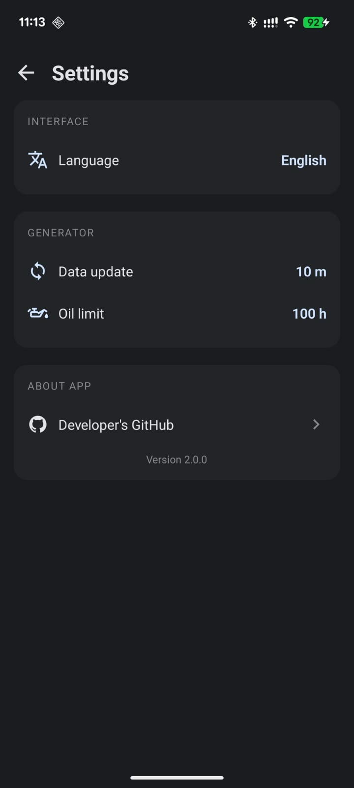

# Generator Monitor ⚡🔋

[](https://reactnative.dev/)
[](https://www.typescriptlang.org/)
[](https://www.i18next.com/)

An Android application designed to monitor generator runtime and track oil service intervals via ESP32 API integration. The app provides real-time data visualization, maintenance tracking, and a customizable settings suite for localizing the interface and adjusting service thresholds

---

## ✨ Key Features

- **Real-time Monitoring**: Instantly track total engine runtime and device connectivity status (Online/Offline) with low-latency updates.
- **Oil Resource Management**: Visual progress bar and percentage tracking for remaining oil life, calculated against customizable service thresholds.
- **Persistent Service History**: Detailed log of all maintenance activities, including custom notes and runtime timestamps, stored locally for offline access via MMKV.
- **Enhanced Configurability**:
  - **Custom Oil Limits**: Define specific maintenance intervals (e.g., 50h, 80h, 100h) to match your generator's requirements.
  - **Sync Frequency**: Adjustable data fetch intervals to balance real-time accuracy and battery efficiency.
- **Multi-language Support**: Fully localized in **English** and **Ukrainian** with an intuitive in-app language switcher.
- **Modern Dark UI**: A sleek, high-contrast dark-themed interface designed for readability in industrial or low-light environments.

---

## 🛠 Tech Stack 

- **Framework**: React Native (TypeScript)
- **Navigation**: React Navigation (Native Stack)
- **Data Fetching**: SWR & Fetch API (Real-time synchronization and caching)
- **State & Storage**: React Hooks & MMKV (High-performance persistent storage)
- **Localization**: i18next & react-i18next
- **Hardware Integration**: ESP32 (HTTP Server exposing a JSON API)
- **UI & Styling**: React Native StyleSheet & Vector Icons

---

## 📸 Screenshots

<table style="width: 100%">
  <tr>
    <td align="center" width="33%">
      <br />
      <b>✅ Generator is online</b>
    </td>
    <td align="center" width="33%">
      <br />
      <b>❌ Generator is offline</b>
    </td>
    <td align="center" width="33%">
      <br />
      <b>⚙️ App Settings</b>
    </td>
  </tr>
</table>

---

## 🚀 Getting Started

Follow these steps to set up the project locally on your machine.

### Prerequisites

Before you begin, ensure you have the following installed:
- **Node.js** (v18 or newer recommended)
- **Yarn** or **NPM**
- **Android Studio** (configured with Android SDK and Emulator)
- **Java Development Kit (JDK)** (v17 recommended for React Native)

### Installation

1. **Clone the repository:**
   
   ```bash
   git clone [https://github.com/vasylkushnir/generator_monitor](https://github.com/vasylkushnir/generator_monitor)
   cd generator-monitor

2. **Install dependencies:**
   ```bash
   yarn install 
   # or
   npm install

3. **Running the App:**
   
  - **Connect your device** via USB or start an Android Emulator.
  - **Run the following command** from the project root:
    ```bash
    npx react-native run-android